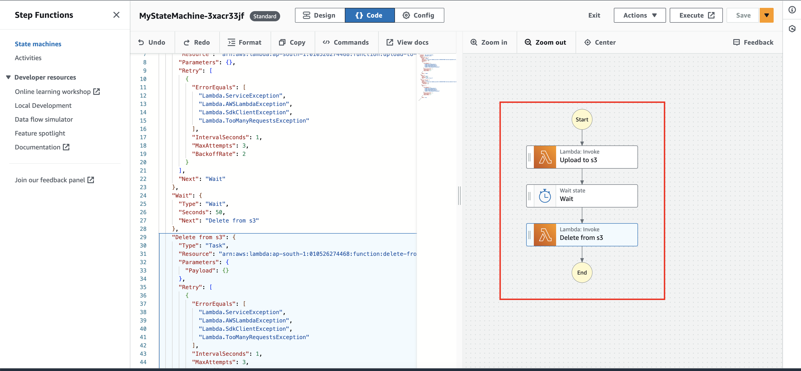
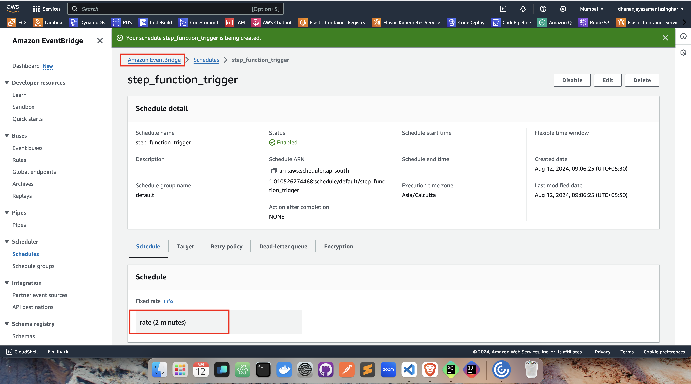

## Create a Step Function

## Setup Event bridge scheduler to trigger the Step Function

#!/bin/bash

# Install AWS CLI
~~~
brew install awscli
~~~

# Configure AWS CLI
~~~
aws configure <<EOF
<aws_access_key_id>
<aws_secret_access_key>
ap-south-1
json
EOF
~~~

# Create an S3 bucket
~~~
aws s3api create-bucket --bucket dhananjayasamantasinghar --region ap-south-1 --create-bucket-configuration LocationConstraint=ap-south-1
~~~
# Check bucket list
~~~
aws s3 ls
~~~

# Create a custom IAM role for Lambda execution
~~~
aws iam create-role \
    --role-name myLambdaExecutionRole \
    --assume-role-policy-document '{
        "Version": "2012-10-17",
        "Statement": [
            {
                "Effect": "Allow",
                "Principal": {
                    "Service": "lambda.amazonaws.com"
                },
                "Action": "sts:AssumeRole"
            }
        ]
    }'
~~~
# Attach AWSLambdaBasicExecutionRole policy to the custom role
~~~
aws iam attach-role-policy \
    --role-name myLambdaExecutionRole \
    --policy-arn arn:aws:iam::aws:policy/service-role/AWSLambdaBasicExecutionRole
~~~

# Create the first Lambda function
~~~
aws lambda create-function \
    --function-name app-1 \
    --runtime python3.10 \
    --role arn:aws:iam::010526274468:role/myLambdaExecutionRole \
    --handler app_1.handler.lambda_handler \
    --zip-file fileb:///Users/dhananjayasamantasinghar/PycharmProjects/python-multi-module-app/dist/app-1.zip
~~~

# Create the second Lambda function
~~~
aws lambda create-function \
    --function-name app-2 \
    --runtime python3.10 \
    --role arn:aws:iam::010526274468:role/myLambdaExecutionRole \
    --handler app_2.handler.lambda_handler \
    --zip-file fileb:///Users/dhananjayasamantasinghar/PycharmProjects/python-multi-module-app/dist/app-2.zip
~~~

# Create IAM role for Step Functions execution
~~~
aws iam create-role \
    --role-name StepFunctionsExecutionRole \
    --assume-role-policy-document '{
        "Version": "2012-10-17",
        "Statement": [
            {
                "Effect": "Allow",
                "Principal": {
                    "Service": "states.amazonaws.com"
                },
                "Action": "sts:AssumeRole"
            }
        ]
    }'
~~~
# Attach AWSLambdaRole policy to the Step Functions execution role
~~~
aws iam attach-role-policy \
    --role-name StepFunctionsExecutionRole \
    --policy-arn arn:aws:iam::aws:policy/service-role/AWSLambdaRole
~~~

# Create the Step Function state machine
~~~
aws stepfunctions create-state-machine \
    --name "MyStateMachine" \
    --definition '{
        "Comment": "My state machine",
        "StartAt": "Upload to s3",
        "States": {
            "Upload to s3": {
                "Type": "Task",
                "Resource": "arn:aws:lambda:ap-south-1:010526274468:function:app-1",
                "Retry": [
                    {
                        "ErrorEquals": [
                            "Lambda.ServiceException",
                            "Lambda.AWSLambdaException",
                            "Lambda.SdkClientException",
                            "Lambda.TooManyRequestsException"
                        ],
                        "IntervalSeconds": 1,
                        "MaxAttempts": 3,
                        "BackoffRate": 2
                    }
                ],
                "Next": "Wait"
            },
            "Wait": {
                "Type": "Wait",
                "Seconds": 50,
                "Next": "Delete from s3"
            },
            "Delete from s3": {
                "Type": "Task",
                "Resource": "arn:aws:lambda:ap-south-1:010526274468:function:app-2",
                "Retry": [
                    {
                        "ErrorEquals": [
                            "Lambda.ServiceException",
                            "Lambda.AWSLambdaException",
                            "Lambda.SdkClientException",
                            "Lambda.TooManyRequestsException"
                        ],
                        "IntervalSeconds": 1,
                        "MaxAttempts": 3,
                        "BackoffRate": 2
                    }
                ],
                "End": true
            }
        }
    }' \
    --role-arn arn:aws:iam::010526274468:role/StepFunctionsExecutionRole
~~~

# Update the Step Functions execution role to allow scheduling
~~~
aws iam update-assume-role-policy \
    --role-name StepFunctionsExecutionRole \
    --policy-document '{
        "Version": "2012-10-17",
        "Statement": [
            {
                "Effect": "Allow",
                "Principal": {
                    "Service": [
                        "states.amazonaws.com",
                        "scheduler.amazonaws.com"
                    ]
                },
                "Action": "sts:AssumeRole"
            }
        ]
    }'
~~~

# Add inline policy to allow the scheduler to start the state machine
~~~
aws iam put-role-policy \
    --role-name StepFunctionsExecutionRole \
    --policy-name AllowSchedulerToStartStepFunction \
    --policy-document '{
        "Version": "2012-10-17",
        "Statement": [
            {
                "Effect": "Allow",
                "Action": "states:StartExecution",
                "Resource": "arn:aws:states:ap-south-1:010526274468:stateMachine:MyStateMachine"
            }
        ]
    }'
~~~

# Create a scheduler to trigger the Step Function
~~~
aws scheduler create-schedule \
    --name "MyStepFunctionSchedule" \
    --schedule-expression "rate(2 minutes)" \
    --flexible-time-window "Mode=OFF" \
    --target "Arn=arn:aws:states:ap-south-1:010526274468:stateMachine:MyStateMachine,RoleArn=arn:aws:iam::010526274468:role/StepFunctionsExecutionRole,Input='{}',RetryPolicy={MaximumRetryAttempts=1}"
~~~

#!/bin/bash

# Delete Step Function Schedule
~~~
aws scheduler delete-schedule --name MyStepFunctionSchedule
~~~

# Delete State Machine
~~~
aws stepfunctions delete-state-machine --state-machine-arn arn:aws:states:ap-south-1:010526274468:stateMachine:MyStateMachine
~~~

# Delete IAM Role Policy for Step Functions Execution Role
~~~
aws iam delete-role-policy --role-name StepFunctionsExecutionRole --policy-name AllowSchedulerToStartStepFunction
~~~

# Detach Managed Policy from Step Functions Execution Role
~~~
aws iam detach-role-policy --role-name StepFunctionsExecutionRole --policy-arn arn:aws:iam::aws:policy/service-role/AWSLambdaRole
~~~

# Delete Step Functions Execution Role
~~~
aws iam delete-role --role-name StepFunctionsExecutionRole
~~~

# Delete Lambda Functions
~~~
aws lambda delete-function --function-name app-1
aws lambda delete-function --function-name app-2
~~~

# Detach Managed Policy from Lambda Execution Role
~~~
aws iam detach-role-policy --role-name myLambdaExecutionRole --policy-arn arn:aws:iam::aws:policy/service-role/AWSLambdaBasicExecutionRole
~~~

# Delete Lambda Execution Role
~~~
aws iam delete-role --role-name myLambdaExecutionRole
~~~

# Delete S3 Bucket Contents
~~~
aws s3 rm s3://dhananjayasamantasinghar --recursive
~~~

# Delete S3 Bucket
~~~
aws s3api delete-bucket --bucket dhananjayasamantasinghar --region ap-south-1
~~~
